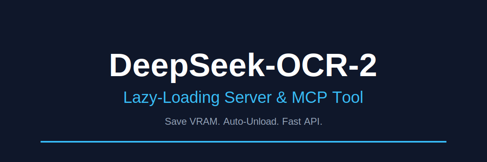

<div align="center">

# DeepSeek-OCR-2 Lazy Server

[](https://opensource.org/licenses/MIT)
[](https://www.python.org/downloads/)
[](https://developer.nvidia.com/cuda-toolkit)
[](https://modelcontextprotocol.io/)

**The efficient way to run DeepSeek's Vision Model locally.**
*Loads on demand. Unloads on idle. Saves your VRAM.*

</div>

---

## ⚡ Why Use This?

Running large Vision-Language Models (VLMs) like DeepSeek-OCR-2 permanently in VRAM is expensive. This **Level 1 Lazy-Loading Server**:

1.  **Starts Instantly**: The process starts in milliseconds (no model load at boot).
2.  **Loads on Demand**: The heavy 7GB+ model only loads when you actually send a request.
3.  **Auto-Unloads**: After 15 minutes of silence (configurable), it wipes the model from GPU memory, giving your VRAM back to your OS, Games, or other AI models.
4.  **MCP Compatible**: Plug-and-play with **Claude Desktop** and other MCP agents.

## 🚀 Installation

### Option A: Conda (Recommended for Local)

```bash
# 1. Create Environment
conda create -n deepseek-ocr2 python=3.11 -y
conda activate deepseek-ocr2

# 2. Install PyTorch (CUDA 12.1 example)
conda install pytorch torchvision torchaudio pytorch-cuda=12.1 -c pytorch -c nvidia -y

# 3. Install Unsloth (Optimized Inference)
pip install --upgrade pip
pip install "unsloth[cu121-torch230] @ git+https://github.com/unslothai/unsloth.git"

# 4. Install Dependencies
pip install -r requirements.txt
```

### Option B: Docker

```bash
# Build
docker build -t deepseek-ocr2-lazy .

# Run (passing GPU)
docker run --gpus all -d \
  -p 8012:8012 \
  -v $(pwd)/models:/data/models \
  -v $(pwd)/output:/data/output \
  --name deepseek-ocr \
  deepseek-ocr2-lazy
```

---

## 🛠 Usage

### 1. Start the Server
```bash
python deepseek_ocr2_lazy_server.py
```
*Port 8012 is the default.*

### 2. OCR an Image (cURL)
```bash
# Extract Markdown (Standard)
curl -X POST "http://localhost:8012/v1/ocr" \
  -F "file=@/path/to/document.png" \
  -F "mode=markdown"

# Raw Text Mode
curl -X POST "http://localhost:8012/v1/ocr" \
  -F "file=@/path/to/receipt.jpg" \
  -F "mode=free"
```

---

## 🤖 MCP Server (Claude Desktop Integration)

Use DeepSeek-OCR-2 directly inside **Claude Desktop** to read documents from your local filesystem.

**Add to your `claude_desktop_config.json`:**

```json
{
  "mcpServers": {
    "deepseek-ocr": {
      "command": "/path/to/conda/envs/deepseek-ocr2/bin/python",
      "args": ["/absolute/path/to/deepseek-ocr2-lazy/deepseek_ocr2_mcp.py"],
      "env": {
        "DS_OCR2_URL": "http://127.0.0.1:8012"
      }
    }
  }
}
```

**Available Tools:**
- `ocr_image(image_path, mode="markdown")`: Reads text/tables from an image file.

---

## ⚙️ Configuration

Set these Environment Variables to tune behavior:

| Variable | Default | Description |
|----------|---------|-------------|
| `DS_OCR2_IDLE_UNLOAD_SECONDS` | `900` | Unload model after 15 mins of inactivity. |
| `DS_OCR2_LOAD_IN_4BIT` | `0` | Set `1` to use 4-bit quantization (lower VRAM). |
| `DS_OCR2_PORT` | `8012` | Server Port. |
| `DS_OCR2_MOCK` | `0` | Set `1` to test without a GPU. |

---

## 📜 Credits
- **Model**: [DeepSeek-OCR-2](https://github.com/deepseek-ai/DeepSeek-OCR-2)
- **Inference**: [Unsloth AI](https://unsloth.ai)
